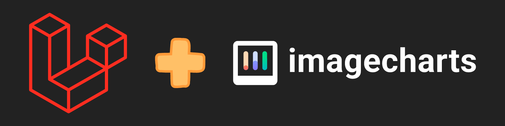
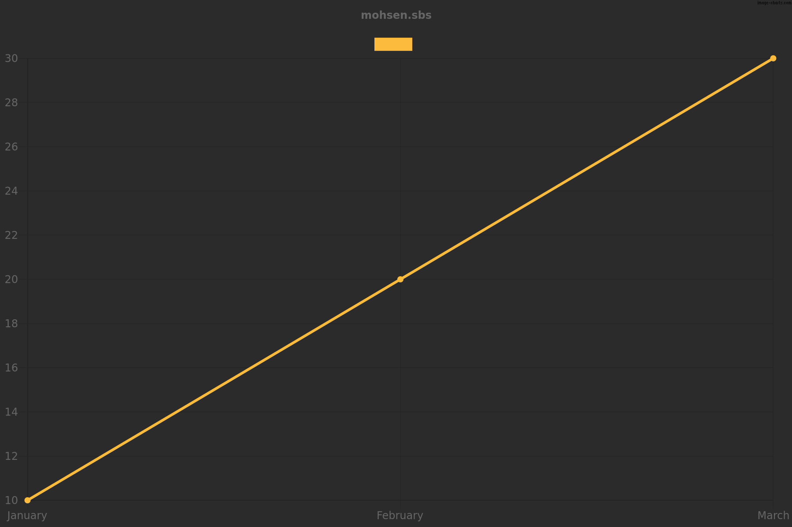
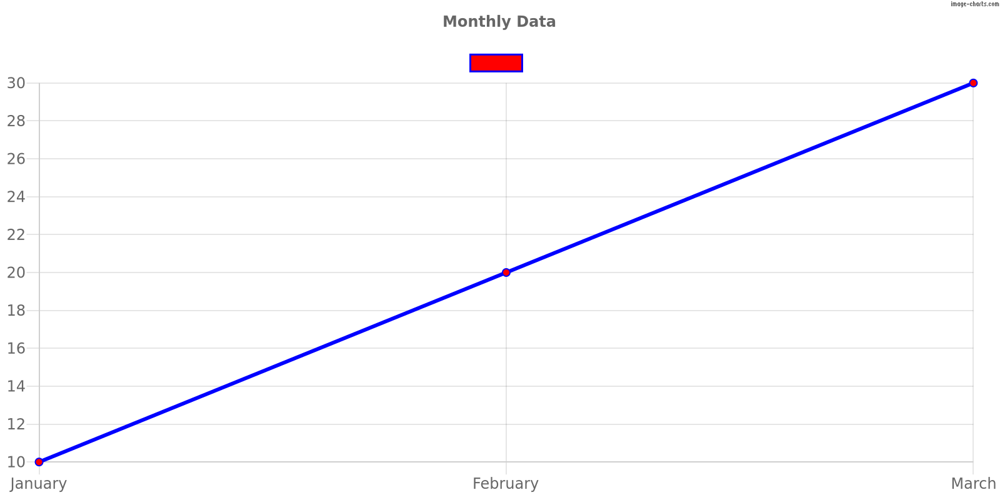

# Laravel Image Charts

Image-charts PHP library to generate charts in image format for your Laravel application.



## Installation

You can install the package via Composer:

```bash
composer require mohsen-mhm/laravel-image-charts
```

### Publish the Configuration File

To publish the configuration file, use the following command:

```bash
php artisan vendor:publish --provider="MohsenMhm\LaravelImageCharts\Providers\ImageChartsServiceProvider" --tag="config"
```

This will create a configuration file named `image-charts.php` in the `config` directory.

---

## Configuration

You can configure the package settings in the `config/image-charts.php` file. The default configuration values are:

```php
return [
    'base_url' => env('IMAGE_CHARTS_BASE_URL', 'https://image-charts.com/chart.js/2.8.0'),
    'default_bg_color' => '#2B2B2B',
    'default_dataset_bg_color' => '#FCBB3D',
    'default_dataset_border_color' => '#FCBB3D',
    'default_width' => '900',
    'default_height' => '600',
    'default_title_text' => 'mohsen.sbs',
    'default_image_path' => storage_path('app/public/charts'),
];
```

## Usage

### Generating a Chart URL

Here's an example of how to use the package to generate a chart URL:

```php
use MohsenMhm\LaravelImageCharts\ImageChart;

$chartUrl = (new ImageChart())
        ->setData([10, 20, 30])
        ->setLabels(['January', 'February', 'March'])
        ->getUrl();
``` 

or use Facade:

```php
use MohsenMhm\LaravelImageCharts\Facades\ImageChartFacade as ImageChart;

$chartUrl = ImageChart::setData([10, 20, 30])
        ->setLabels(['January', 'February', 'March'])
        ->getUrl();
```

You can then use this URL to display the chart in your application.

```bladehtml

```

### Downloading the Chart Image

You can also download the generated chart image to a local file. If no path is specified, the image will be saved to the
default path specified in the configuration file.

```php
use MohsenMhm\LaravelImageCharts\ImageChart;

$fullImagePath = (new ImageChart())
        ->setData([10, 20, 30])
        ->setLabels(['January', 'February', 'March'])
        ->getImage();
``` 

or use Facade:

```php
use MohsenMhm\LaravelImageCharts\Facades\ImageChartFacade as ImageChart;

$fullImagePath = ImageChart::setData([10, 20, 30])
        ->setLabels(['January', 'February', 'March'])
        ->getImage();

```

This will save the image to the default path with a generated file name and return the full path to the saved image. You
can also specify a custom path:

```php
use MohsenMhm\LaravelImageCharts\ImageChart;

$customPath = storage_path('app/public/custom_charts');

$fullImagePath = (new ImageChart())
        ->setData([10, 20, 30])
        ->setLabels(['January', 'February', 'March'])
        ->getImage($customPath);
``` 

or use Facade:

```php
use MohsenMhm\LaravelImageCharts\Facades\ImageChartFacade as ImageChart;

$customPath = storage_path('app/public/custom_charts');

$fullImagePath = ImageChart::setData([10, 20, 30])
        ->setLabels(['January', 'February', 'March'])
        ->getImage($customPath);
```

### Output



## Full Usage Example

```php
use MohsenMhm\LaravelImageCharts\ImageChart;

try {
    $imageChart = (new ImageChart())
        ->setLabels(['January', 'February', 'March'])
        ->setData([10, 20, 30])
        ->setBackgroundColor('#FFFFFF')
        ->setDatasetBackgroundColor('#FF0000')
        ->setDatasetBorderColor('#0000FF')
        ->setWidth('800')
        ->setHeight('400')
        ->setTitleText('Monthly Data');

    $chartUrl = $imageChart->getUrl();
    $imagePath = $imageChart->getImage();
    $binaryData = $imageChart->getBinary();

    echo "Chart URL: $chartUrl\n";
    echo "Image saved at: $imagePath\n";
    echo "image in binary format: $binaryData\n";
} catch (InvalidArgumentException $e) {
    echo 'Error: ' . $e->getMessage();
}
```

### Output

```text
Chart URL: https://image-charts.com/chart.js/2.8.0 ...
Image saved at: .../storage/app/public/charts/chart_1718432986.png
image in binary format: b"ëPNG \x1A \x00\ ..."
```



## Methods

The ImageChart class provides the following methods for configuring your chart:

* `setData(array $data)`: Set the data points for the chart.
* `setLabels(array $labels)`: Set the labels for the chart.
* `setBackgroundColor(string $color)`: Set the background color for the chart.
* `setDatasetBackgroundColor(string $color)`: Set the background color for the dataset.
* `setDatasetBorderColor(string $color)`: Set the border color for the dataset.
* `setWidth(string $width)`: Set the width of the chart.
* `setHeight(string $height)`: Set the height of the chart.
* `setTitleText(string $title)`: Set the title text of the chart.
* `getUrl()`: Generate and return the chart URL.
* `getImage(string $path = null)`: Download the chart image to a specified local file path, or use the default path
  if not specified. Returns the full path to the saved image.
* `getBinary()`: Generate and return the chart image in binary format.

## License

This package is open-sourced software licensed under the [MIT license](https://mit-license.org/).

## Contributing

Contributions are welcome! Please feel free to submit a Pull Request on GitHub.

More chart types & features coming soon... :)

## Authors

[Mohsen Mohammadi](https://mohsen.sbs) - Developer
For more information, please visit the [GitHub repository](https://github.com/Mohsen-mhm/laravel-image-charts).
